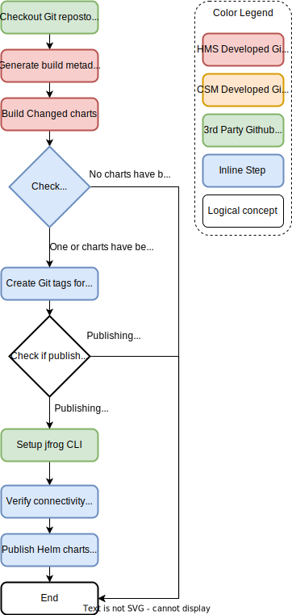
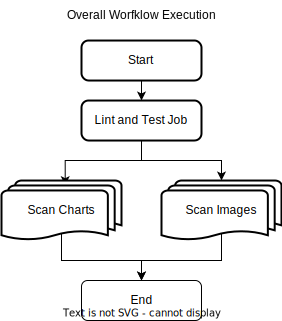
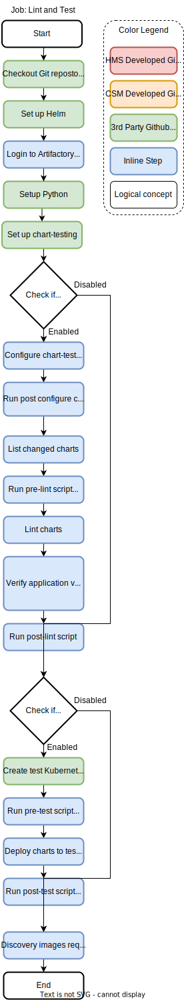
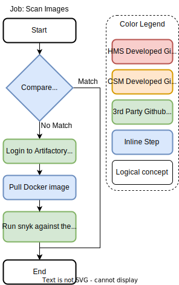
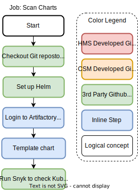

# hms-build-chart-workflows

- [hms-build-chart-workflows](#hms-build-chart-workflows)
  - [Build and Release charts workflow](#build-and-release-charts-workflow)
    - [Workflow inputs](#workflow-inputs)
    - [Workflow secrets](#workflow-secrets)
    - [Example usage](#example-usage)
  - [Charts lint, test, and scan workflow](#charts-lint-test-and-scan-workflow)
    - [Workflow inputs](#workflow-inputs-1)
    - [Workflow secrets](#workflow-secrets-1)
    - [Lint and Test job](#lint-and-test-job)
    - [Scan image job](#scan-image-job)
    - [Scan chart job](#scan-chart-job)
    - [Example usage](#example-usage-1)
  - [Release model](#release-model)

The hms-build-image-workflows repository contains Github Action workflows to facilitate the process of building and testing Helm charts from HMS repositories.

## Build and Release charts workflow



The build and release charts workflow is composed of a single job that is used to package and publish Helm charts from a HMS Helm chart repository. Stable artifacts are produced when a PR or branch is merged to main. For all other pushes or PRs an unstable artifact is produced.

At a high level this workflow performs the following actions:
1. Build and package Helm charts.
   1. Changes to the main branch will publish stable builds of the Helm charts that have not previously been released.
   2. Changes to any other branch will publish unstable builds for the Helm charts that changed..
2. If any new stable helm chart has been built, create a git tag in the form of `helm-chart-name-x.y.z` and push it to the repository.
   > In the HMS Chart repositories Git tags are used to keep track if a stable build of a Helm chart has been previously built. To rebuild or replace an already released Helm chart one can delete the Git tag, and then re-run the build and release charts workflow. 
3. Upload any packaged Helm charts into the appropriate location within Artifactory.

The build and release charts workflow is composed of various 3rd party and internally developed Github Actions.
- Internally developed Github Actions:
  - [Cray-HPE/hms-build-metadata-action/generate-build-metadata@v1](https://github.com/Cray-HPE/hms-build-metadata-action/tree/v1/generate-build-metadata)
  - [Cray-HPE/hms-build-changed-charts-action@v1](https://github.com/Cray-HPE/hms-build-changed-charts-action/tree/v1)

- 3rd party Github Actions:
  - [actions/checkout@v2](https://github.com/actions/checkout/tree/v2)
  - [jfrog/setup-jfrog-cli@v1](https://github.com/jfrog/setup-jfrog-cli/tree/v1)
### Workflow inputs
| Name                    | Data Type | Required Field | Default value     | Description
| ----------------------- | --------- | -------------- | ----------------- | -----------
| `runs-on`               | `string`  | Required       | `ubuntu-latest`   | The type of machine to run the job on.
| `target-branch`         | `string`  | Optional       | `master`          | Git repository branch to check against when determining charts that have changed.
| `artifactory-repo`      | `string`  | Optional       | `csm-helm-charts` | Repository in Artifactory to publish Helm charts to.
| `artifactory-component` | `string`  | Required       |                   | The component is used to sort helm charts from the same repo internally in Artifactory.
| `enable-publish`        | `boolean` | Optional       | `true`            | Control the ability for this workflow to publish artifacts to Artifactory and create Git tags.

### Workflow secrets
| Name                      | Required Field | Description 
| ------------------------- | -------------- | ----------- 
| `jfrog-cli-configuration` | Required       | JFrog CLI configuration with permissions to upload artifacts to Artifactory.

### Example usage
Sample build and release charts images workflow (`.github/workflows/build_and_release_charts.yaml`) in use by the [hms-power-control-charts repository](https://github.com/Cray-HPE/hms-power-control-charts/blob/main/.github/workflows/build_and_release_charts.yaml). 

**IMPORTANT** when creating or migrating a repository to use this workflow make sure that the value for `.jobs.build_and_release.with.artifactory-component` is set to the desired name of the folder to store the published Helm charts withing artifactory. This is typically the same as the name of the chart.
```yaml
name: Build and Publish Helm charts
on: [push, workflow_dispatch]
jobs:
  build_and_release:
    uses: Cray-HPE/hms-build-chart-workflows/.github/workflows/build_and_release_charts.yaml@v1
    with:
      artifactory-component: cray-hms-power-control # This is the only field that needs to be changed
      target-branch: main
    secrets:
      jfrog-cli-configuration: ${{ secrets.ARTIFACTORY_ALGOL60_JFROG_CLI_CONFIGURATION }}
```

## Charts lint, test, and scan workflow



The chart lint, test, and scan workflow located at `.github/workflows/charts_lint_test_scan.yaml` in this repository will lint, test, and scan Helm charts when a PR is opened to a HMS Helm chart repository.

The workflow is composed of three jobs:
1. The [Lint and Test job](#lint-and-test-job) will use chart-testing to lint any changed charts in the pull request, and if enabled deploy any changed Helm charts to a test Kubernetes cluster using Kind to run tests against.
2. **For each** image detected in a changed chart a [Scan image job](#scan-image-job) will be created to run Snyk against the image to find vulnerabilities.  
3. **For each** changed chart a [Scan chart job](#scan-chart-job) will be created to run Snyk against the chart to find vulnerabilities.

### Workflow inputs

| Name                             | Data Type | Required Field | Default value          | Description
| -------------------------------- | --------- | -------------- | ---------------------- | -----------
| `runs-on`                        | `string`  | Optional       | `ubuntu-latest`        | The type of machine to run the job on.
| `charts-base`                    | `string`  | Optional       | `charts`               | Base directory containing the the chart version directories.
| `lint-charts`                    | `boolean` | Optional       | `True`                 | Lint and test Helm charts
| `test-charts`                    | `boolean` | Optional       | `False`                | Lint and test Helm charts
| `ct-config`                      | `string`  | Optional       |                        | Chart testing configuration
| `ct-yaml`                        | `string`  | Optional       | `ct.yaml`              | Chart testing configuration file
| `ct-yaml-post-script`            | `string`  | Optional       |                        | Bash script that runs after the Chart testing configuration file is configured.
| `lint-pre-script`                | `string`  | Optional       |                        | Bash script that runs before `ct lint`
| `lint-post-script`               | `string`  | Optional       |                        | Bash script that runs after `ct lint`
| `test-pre-script`                | `string`  | Optional       |                        | Bash script that runs before `ct install`
| `test-post-script`               | `string`  | Optional       |                        | Bash script that runs after `ct install`
| `scan-charts`                    | `boolean` | Optional       | `True`                 | Template charts and scan Kubernetes resources with Snyk
| `scan-chart-snyk-args`           | `string`  | Optional       |                        | Additional Snyk args when scanning images (e.g., `--severity-threshold=high`)
| `scan-images`                    | `boolean` | Optional       | `True`                 | Scan container images with Snyk
| `scan-images-ignore-prefix-list` | `string`  | Optional       | `["dtr.dev.cray.com"]` | List of image prefixes to ignore when scanning images with Snyk. This field is a JSON array of strings.
| `scan-image-snyk-args`           | `string`  | Optional       |                        | Additional Snyk args when scanning images (e.g., `--severity-threshold=high`)


### Workflow secrets
| Name         | Required Field | Description 
| ------------ | -------------- | ----------- 
| `snyk-token` | Required       | Snyk authorization token.

### Lint and Test job



The lint and test job performs the following high level actions when a pull request is opened:
1. Configures chart-testing to be aware of the Helm charts present in the repository by updating the `chart-dirs` field in the repos `ct.yaml` file.
   > **NOTE** The HMS chart repositories version charts by directories `charts/vX.Y` and allows for multiple versions of a chart to exist side by side. 
2. Determine any charts that have been modified in the current branch when compared against the base branch of the PR that triggered the workflow run.
3. **For all** charts in the repo verify the application version specified in `Chart.yaml` matches the application version specified in `values.yaml`. 
4. If testing is enabled, use Kind to spin up a test Kubernetes cluster and install Helm charts from the repository into the test cluster.
   > **IMPORTANT** Currently in all of the hms-*-charts repositories this option is turned off. This is due to the Kubernetes cluster stood up by Kind is missing dependencies (Istio, ETCD operator, Postgres operator, etc...) required by the cray-service chart are not present. Further investigation is required to determine how we can successfully enable this option. 
5. Extract all container images that are referenced by the Helm charts changed in this pull request. This is done by templating the Helm chart and extracting `image:` fields.

The update PR with comment job is composed of mostly 3rd part Github Actions
- 3rd party Github Actions:
  - [actions/checkout@v2](https://github.com/actions/checkout/tree/v2)
  - [actions/setup-python@v2](https://github.com/actions/setup-python/tree/v2)
  - [azure/setup-helm@v1.1](https://github.com/azure/setup-helm/tree/v1.1)
  - [helm/kind-action@v1.2.0](https://github.com/helm/kind-action/tree/v1.2.0)

### Scan image job



A Scan image job will be created for each detected container detected from a chart that was change in a PR. Synk will be used to scan the referenced container image for vulnerabilities.

The update PR with comment job is composed of mostly 3rd part Github Actions
- 3rd party Github Actions:
  - [snyk/actions/docker@master](https://github.com/snyk/actions/tree/master/docker)

### Scan chart job



A Scan chart job will be created for each chart that was changed in a PR. It will template the Helm chart, and then use Snyk to scan the templated Kubenernetes resources for vulnerabilities. 

The container image will not be scanned if it matches one of the prefixes specified in the `inputs.scan-images-ignore-prefix-list` input. We want to scan all images that one of Helm charts reference using Snyk, this option should only be used to support building legacy Helm charts targeted at CSM 1.0 or older. This input is encoded as a JSON array of strings, with the default value of:
```json
["dtr.dev.cray.com"]
```

The update PR with comment job is composed of mostly 3rd party Github Actions
- 3rd party Github Actions:
  - [actions/checkout@v2](https://github.com/actions/checkout/tree/v2)
  - [azure/setup-helm@v1.1](https://github.com/azure/setup-helm/tree/v1.1)
  - [snyk/actions/iac@master](https://github.com/snyk/actions/tree/master/iac)

### Example usage
Sample lint, test, and scan helm charts workflow (`.github/workflows/charts_lint_test_scan.yaml`) in use by the [hms-power-control-charts repository](https://github.com/Cray-HPE/hms-power-control-charts/blob/main/.github/workflows/charts_lint_test_scan.yaml).
```yaml
name: Lint, test, and scan Helm charts
on:
  pull_request:
    branches:
      - master
      - main
      - release/**
  workflow_dispatch:
jobs:
  lint-test-scan:
    uses: Cray-HPE/hms-build-chart-workflows/.github/workflows/charts_lint_test_scan.yaml@v1
    with:
      lint-charts: ${{ github.event_name == 'pull_request' }}
      test-charts: false
      ct-yaml: ct.yaml
      scan-image-snyk-args: "--severity-threshold=high"
      scan-chart-snyk-args: "--severity-threshold=high"
    secrets:
      snyk-token: ${{ secrets.SNYK_TOKEN }}
```
## Release model

When you make changes you should tag the code branch with an vX.Y.Z semver and move/create the vX tag.

the vX tag (eg v1) is used by the 'invoking' workflows.  The contract is that vX(n) MUST be backwards compatible.  
the vX.Y.Z tag is used to distinguish code changes as a release.